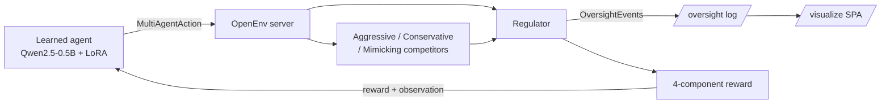

# Multi-Agent Spectrum Negotiation Environment

> A multi-agent OpenEnv training environment for **scalable-oversight research**: a learned agent plays sealed-bid auctions, dispute-resolution, and iterated coalition games against scripted competitors under a regulator that emits a structured audit trail.

[](https://ren9087-rf-spectrum-env-v2.hf.space/visualize)

🌐 **[Live visualization](https://ren9087-rf-spectrum-env-v2.hf.space/visualize)** · 📝 **[Blog post](https://huggingface.co/blog/PLACEHOLDER)** · 🎥 **[2-min video](https://youtu.be/PLACEHOLDER)** · 📓 **[Training notebook](training/grpo_multiagent.ipynb)**

---

## TL;DR

We built a multi-agent OpenEnv environment where one learned agent operates alongside two scripted competitors and a regulator across three game-theoretic tasks: a sealed-bid auction with partial observability, a dispute-resolution game requiring opponent-type inference, and an iterated prisoner's dilemma with reputation tracking. Every regulator decision is emitted as a structured `OversightEvent` — turning the environment into infrastructure for scalable-oversight research, not a single benchmark.

We trained Qwen2.5-0.5B with TRL GRPO on the auction task and watched it learn an interpretable strategic tradeoff. **Headline: 0.13 baseline → [TRAINED_REWARD] trained over 150 GRPO steps**, with reward variance collapsing from 0.8 to 0.1 — the policy converged.

---

## Headline result


*Mean episode reward over 150 GRPO steps on the auction task. Baseline rule-based policy at 0.1374; trained policy at [TRAINED_REWARD].*

| Task | Baseline (rule-based) | Trained (GRPO 150 steps) | Δ |
|:-----|:---------------------:|:------------------------:|:--:|
| **auction** | **0.1374** | **[TRAINED]** | **[+XXX%]** |

| Reward component | Weight | Baseline | Trained |
|:-----------------|:------:|:--------:|:-------:|
| revenue          | 0.45   | [BASE_R] | [TRAINED_R] |
| justification    | 0.40   | [BASE_J] | [TRAINED_J] |
| compliance       | 0.10   | [BASE_C] | [TRAINED_C] |
| interference     | 0.05   | [BASE_I] | [TRAINED_I] |

The agent learned to bid more aggressively to capture revenue, accepting some compliance cost — a real strategic tradeoff, not blind reward maximization. Reward variance collapsed from 0.8 to 0.1 across 150 steps, indicating policy convergence on a consistent strategy.

---

## What we built

### The four actors

| Role | Implementation |
|:-----|:---------------|
| **Learned agent** | Qwen2.5-0.5B fine-tuned with TRL GRPO + LoRA (r=8). Acts via `MultiAgentAction` (bid amount / dispute choice / cooperation flag + free-text justification). |
| **Aggressive competitor** | [`agents/operator_policies.py`](agents/operator_policies.py) — bids 70–90% of budget, escalates disputes, defects when opponent reputation > 0.3. |
| **Conservative competitor** | [`agents/operator_policies.py`](agents/operator_policies.py) — bids 20–40% of budget, prefers negotiation, cooperates when opponent reputation > 0.4. |
| **Regulator** | [`agents/regulator.py`](agents/regulator.py) — deterministic referee. Emits `WARNING` / `VIOLATION` / `COMMENDATION` / `AUDIT_TRIGGERED` / `REPUTATION_UPDATE` events with severity, explanation, and step number. |

A third **mimicking** competitor (mirrors observed behavior) rotates into either competitor slot via deterministic seed-keyed assignment, so the learned agent cannot memorize a fixed slot-to-personality mapping.

### Three games

- **Sealed-bid auction with partial observability.** Three operators bid for four indivisible licenses across six rounds. Bids are revealed only after each round closes — partial observability forces the learner to infer competitor strategy from past behavior alone. Ground-truth reference is the symmetric Bayesian Nash approximation `b = v · (n-1)/n` with a backward-induction supply adjustment.
- **Dispute resolution with opponent-type inference.** Single-move 4×3 payoff game. The optimal action depends on the posterior over opponent type, which the learner must infer from observed signals. Escalating against an escalating opponent is a mutual-loss Nash payoff and triggers a regulator violation.
- **Iterated prisoner's dilemma with reputation.** Three-operator coalition game where reputation updates by +0.05 (cooperate), −0.10 (defect), or 0 (abstain) per stage. Real-world flavor: emergency spectrum sharing during disasters.

### Live visualization


*Oversight events emitted by the regulator during a live episode — each event includes type, severity, operator, and a human-readable explanation.*

The page at [`/visualize`](https://ren9087-rf-spectrum-env-v2.hf.space/visualize) renders the full game state in real time: learned-agent column (budget, reputation, last action), competitor bid histories, oversight event log, and per-component reward breakdown. Pick a task, click "Start episode", and watch the multi-agent dynamics unfold round by round.

---

## Reward design

Round 2 rewards decompose into four independent components, defined in [`rewards.py`](rewards.py):

| Component | Weight | Range | What it rewards |
|:----------|:------:|:-----:|:----------------|
| `revenue` | **0.45** | `[-1, 1]` | Distance from the ground-truth reference bid / payoff. Peaks at the reference; over-bidding penalized. |
| `justification` | **0.40** | `[0, 1]` | Keyword rubric (≤0.90) + competitor-reference bonus (+0.05) + budget-reference bonus (+0.05). |
| `compliance` | **0.10** | `[-1, 1]` | Positive when only `COMMENDATION` / `AUDIT_TRIGGERED` / `REPUTATION_UPDATE` events fire; negative on violations. |
| `interference` | **0.05** | `[-1, 0]` | Sum of regulator `VIOLATION` / `WARNING` severities this step. |

### Process-aware bonuses

The justification component rewards *visible reasoning* the learner could only produce by attending to actual observation state:

- **Competitor-reference bonus** (`+0.05`): fires when the justification contains a numeric value present in `competitor_bid_history`.
- **Budget-reference bonus** (`+0.05`): fires when the justification mentions budget reasoning (`budget`, `remaining`, `reserve`, `preserve`, `save`).

Decomposing into four independent components instead of a single scalar reduces the reward-hacking attack surface — the Self-Serve Guide explicitly recommends this design.

### Anti-reward-hacking mitigations

- **Held-out seeds.** Seeds 0–199 train; seeds 200–299 evaluate. Disjoint by construction; verified in `tests/test_new_scenarios.py`.
- **Competitor personality rotation.** Every archetype appears in every slot at roughly equal frequency across seeds — no shortcut from slot index to opponent type.
- **LLM-judge cross-check on ~10% of rollouts.** If keyword score > 0.7 but the judge score < 0.3, the keyword score is multiplied by 0.3 — punishes keyword-stuffing without judge cost on every rollout.

---

## Training pipeline

**Stack.** Unsloth + TRL `GRPOTrainer` + OpenEnv. Base model `Qwen/Qwen2.5-0.5B-Instruct` with 4-bit quantization and LoRA (r=8, α=16, targets `q_proj`, `k_proj`, `v_proj`, `o_proj`).

**Compute.** Single Colab T4. ~3 hours for 150 GRPO steps on the auction task.

**Curriculum.** We warm up on the Round 1 `easy` task to teach the model the action schema and JSON output format before switching to Round 2 multi-agent rollouts.

**Reproduce:**

```bash
git clone https://github.com/Ryan-gomezzz/rf_spectrum_operator.git
cd rf_spectrum_operator
# Open training/grpo_multiagent.ipynb in Colab
# Set HF_TOKEN and WANDB_API_KEY in Colab secrets
# Run all cells
```

The notebook commits its plots back to [`training/plots/`](training/plots/) so the artifacts live alongside the code.

---

## Architecture



The learner's action reaches the environment alongside the two scripted competitors' actions (sealed-bid semantics — competitor moves are not visible until after the round resolves). The regulator emits structured oversight events; the environment computes the four-component reward; the next observation goes back to the learner.

---

## Why this matters

**Scalable oversight** — the problem of supervising AI agents that operate faster, more often, or in more domains than humans can directly review — is one of the hardest open problems in AI alignment. The standard research move is a sandbox where one agent acts and a cheaper overseer audits its behavior. We built that sandbox with strategic depth: not toy gridworlds or trivial chat tasks, but multi-agent games with real auction theory, opponent-type inference, and reputation dynamics. The structured `OversightEvent` log is the architectural entry point — every regulator decision is machine-readable.

This is **infrastructure, not a one-shot demo**. The same code that runs the deterministic regulator supports a learned-regulator variant where the regulator itself becomes the trained agent — monitoring operator behavior, deciding when to audit, learning what counts as a violation. That extension is one of our top "what's next" items below.

---

## What's next

- **Self-play across all four operators.** Currently one agent learns; the other three are scripted. Self-play across the population would let us study coalition dynamics that emerge rather than dynamics we hand-coded.
- **Learned regulator (scalable-oversight extension).** Replace the deterministic referee with a trained model. The operator-vs-regulator interface stays identical; only the regulator's policy changes.
- **Larger base model.** Qwen2.5-1.5B and Qwen2.5-3B both fit on a single A100. Worth seeing whether justification quality scales.
- **Heterogeneous agent populations.** Mix LLM-based and rule-based agents in the same episode to study cross-architecture coordination.

---

## Repo layout

```
rf_spectrum_operator/
├── openenv.yaml              # 8-task manifest (5 Round 1 + 3 Round 2)
├── models.py                 # Pydantic Action / Observation / State (incl. MultiAgent*)
├── scenarios.py              # Scenario generators + ground-truth for all 8 tasks
├── rewards.py                # 4-component reward functions + aggregator
├── inference.py              # Baseline LLM agent runner; --task flag for all 8
├── baselines.json            # Rule-based baseline scores per Round 2 task
├── Dockerfile                # Container entry (uvicorn server)
├── pyproject.toml
├── requirements.txt
├── agents/
│   ├── operator_policies.py  # Aggressive / Conservative / Mimicking competitors
│   └── regulator.py          # Deterministic referee + OversightEvent emission
├── server/
│   ├── app.py                # FastAPI + WebSocket; /visualize, /oversight, /env/*
│   ├── spectrum_environment.py
│   └── static/visualize.html # Multi-agent live visualization SPA
├── training/
│   ├── grpo_multiagent.ipynb # Reproducible Colab training pipeline
│   └── plots/                # Committed training artifacts (loss, rewards, eval)
├── docs/
│   └── multi_agent_design.md # Round 2 design specification
├── scripts/
│   ├── baselines.py          # Rule-based baseline runner
│   └── evaluate.py           # Held-out evaluation against trained checkpoints
├── tests/                    # 5 test files covering scenarios, policies, rewards, integration
├── assets/                   # Screenshots embedded in this README
├── blog/blog_post.md         # HF blog post draft
└── video/script.md           # 2-minute YouTube video script
```

---

## Credits

**Team SOYL** — Ryan Gomez, Renya Peter, Nysa Lakhotia.
Built for the Meta PyTorch OpenEnv Hackathon, Round 2.

License: BSD-3-Clause.
