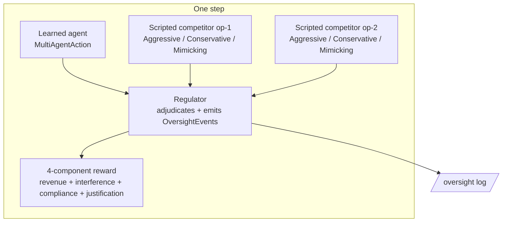
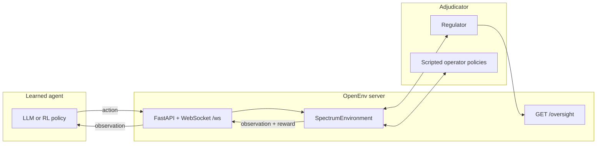

<div align="center">

# RF Spectrum Allocation Environment — Round 2

**A multi-agent training environment for scalable oversight: learned agents play against scripted opponents under a regulator that emits a structured audit trail.**


<br/>

[](LICENSE)
[](https://python.org)
[](https://github.com/meta-pytorch/OpenEnv)
[](Dockerfile)
[](server/app.py)

<br/>

| | |
|:---:|:---|
| **Domain** | Multi-agent games with a reputation-tracking regulator (telecom substrate) |
| **API** | `reset()` · `step(action)` · `state` · `get_oversight_log()` (OpenEnv) |
| **Tasks** | **5 Round 1** (single-agent) · **3 NEW multi-agent**: auction · dispute · coalition |
| **Reward** | 4 components summing to 1.0: revenue (0.45) · justification (0.40) · compliance (0.10) · interference (0.05) |

<sub>OpenEnv manifest: [`openenv.yaml`](openenv.yaml) · Env name: `rf_spectrum_env` · Design spec: [`docs/multi_agent_design.md`](docs/multi_agent_design.md) · Round 1 submission: [Ryan-gomezzz/rf_spectrum](https://github.com/Ryan-gomezzz/rf_spectrum)</sub>

<br/>

| | |
|:---|:---|
| 🌐 **Live demo** | [ren9087-rf-spectrum-env-v2.hf.space/visualize](https://ren9087-rf-spectrum-env-v2.hf.space/visualize) |
| 🤗 **HF Space** | [huggingface.co/spaces/ren9087/rf-spectrum-env-v2](https://huggingface.co/spaces/ren9087/rf-spectrum-env-v2) |
| 💻 **GitHub** | [github.com/Ryan-gomezzz/spectrum_operator](https://github.com/Ryan-gomezzz/spectrum_operator) |
| 🧠 **Trained model** | [huggingface.co/ren9087/rf-spectrum-auction-trained](https://huggingface.co/ren9087/rf-spectrum-auction-trained) |
| 📖 **API docs** | [ren9087-rf-spectrum-env-v2.hf.space/docs](https://ren9087-rf-spectrum-env-v2.hf.space/docs) |
| 📊 **Slide deck** | [Google Slides](https://docs.google.com/presentation/d/1cRejKbS5YqmxirWOb1Nl5nOr2dquu4ld/edit?usp=sharing&ouid=107453993982747998827&rtpof=true&sd=true) |
| 📓 **Training notebook (Auction)** | [Google Colab](https://colab.research.google.com/drive/168FsGK-gvJ3Zo47b2ykFC-IzS3Nl_F_F?usp=sharing) |
| 📓 **Training notebook (Coalition)** | [Google Colab](https://colab.research.google.com/drive/12isISlmVJ-J9bFILsrcvFWbzjqGodwNS?usp=sharing) |
| 📓 **Training notebook (Dispute)** | [Google Colab](https://colab.research.google.com/drive/1wAq7kLLTn3YmT31RKBZKyOTihlJafVXr?usp=sharing) |
| 🎥 **Demo video** | [YouTube](https://youtu.be/bYnTYGnRPto) |
</div>

---

## Navigate

| Section | What you'll find |
|:--------|:-----------------|
| [Why this matters](#why-this-matters) | Scalable oversight + multi-agent games |
| [How it works](#how-it-works) | One-step multi-agent orchestration diagram |
| [Spectrum grid & actors](#spectrum-grid--actors) | Bands, competitors, regulator |
| [Action & observation spaces](#action--observation-spaces) | `MultiAgentAction` / `MultiAgentObservation` |
| [Tasks](#tasks) | All 8 tasks (5 Round 1 + 3 Round 2) |
| [Reward function](#reward-function) | 4 components, process bonuses, anti-hacking |
| [Quick start](#quick-start) | Docker, local dev, `inference.py`, Python client |
| [Visualization](#visualization) | Live demo SPA at `/visualize` |
| [Oversight endpoint](#oversight-endpoint) | `GET /oversight` for the demo |
| [Submission & validation hints](#submission--validation-hints) | URLs, env vars, logs |
| [Baseline scores](#baseline-scores) | Placeholder table for Round 2 results |
| [Repo layout](#repo-layout) | Files and folders |
| [Research angles](#research-angles) | Scalable oversight, theory of mind, coalition formation |

---

## Why this matters

Round 2 reframes the environment as a **multi-agent training ground** with a first-class **regulator** in the loop. The spectrum domain is substrate; the research question is *how does an agent learn to bid, negotiate, and cooperate against other players — while staying within what a lightweight overseer can check?*

| If the learned agent… | What this benchmark captures |
|:----------------------|:-----------------------------|
| Overbids against an unseen opponent | Winner's-curse penalty in the `revenue` component |
| Colludes on equal bids | Regulator emits `VIOLATION`; `compliance` drops |
| Keyword-stuffs its justification | LLM-judge cross-check cuts the score by 70 % |
| Defects once reputation is high | Regulator issues a high-reputation `WARNING` |
| Memorises a fixed opponent slot | Deterministic seed-keyed rotation breaks the shortcut |

Scalable oversight, theory-of-mind inference, and coalition formation are the three research axes this environment was built to expose. Every regulator decision appears in a structured `OversightEvent` log accessible over HTTP — the demo renders it live.

---

## Visualization

### Live visualization

Open the deployed Space at /visualize for a live multi-agent episode visualization. The page shows the learned agent's state, competitor bid histories, regulator oversight events, and per-component rewards in real time as an episode unfolds.

URL: https://ren9087-rf-spectrum-env-v2.hf.space/visualize

Demo: pick "auction" from the task selector, click "Start episode" — the page polls the environment every 1.5 seconds and renders the multi-agent dynamics including the structured oversight log emitted by the regulator (the scalable-oversight audit trail).

---

## How it works

### One step of a Round 2 multi-agent game



The learner's action reaches the regulator simultaneously with the two scripted competitors' actions (sealed-bid semantics). The regulator resolves the round, emits one or more structured events, updates reputations or debits budgets, and hands control back to the environment, which computes the 4-component reward and returns the next observation.

### Architecture (OpenEnv + regulator + oversight endpoint)



---

## Spectrum grid & actors

### Spectrum grid

12 bands from **~700 MHz** to **~5.25 GHz**, unchanged from Round 1. Round 2 games treat the grid as flavor; the strategic action is the bid / dispute choice / cooperation flag.

| Band | Range (approx.) | Type | Max power | Real-world flavor |
|:---:|:---|:---|:---:|:---|
| **0** | 700 MHz | Protected | 30 dBm | Public safety / FirstNet-style |
| **1–2** | 700 MHz LTE | Licensed | 43 dBm | Macro LTE FDD |
| **3–4** | 850 MHz | Licensed | 40 dBm | Legacy cellular |
| **5–6** | ~1700 MHz (AWS-1) | Licensed | 38 dBm | Mid-band LTE / backhaul |
| **7–8** | 2.4 GHz ISM | Unlicensed | 20 dBm | Wi-Fi / IoT |
| **9** | 3.5 GHz CBRS PAL | Shared | 30 dBm | Licensed shared / PAL |
| **10** | 3.6 GHz CBRS GAA | Shared | 23 dBm | General authorized access |
| **11** | 5 GHz UNII-1 | Unlicensed | 23 dBm | Wi-Fi 5/6 low segment |

### Competitors and regulator (NEW in Round 2)

| Actor | Role | Behavioral signature |
|:------|:-----|:---------------------|
| **Learned agent (op-0)** | The player being trained | Acts via `MultiAgentAction`; its only opponent-type signal is observed behavior |
| **Aggressive competitor** | Scripted opponent | Auctions: bids 70–90 % of budget, tapering late. Disputes: `ESCALATE` 80 % / `AUDIT` 20 %. Coalitions: defects whenever reputation > 0.3 |
| **Conservative competitor** | Scripted opponent | Auctions: 20–40 % of budget with low variance. Disputes: `NEGOTIATE` 60 % / `CONCEDE` 40 %. Coalitions: cooperates when reputation > 0.4 |
| **Mimicking competitor** | Scripted opponent | Auctions: bids the running average of observed bids. Disputes / coalitions: mirrors the learner's last visible choice |
| **Regulator** | Deterministic referee | Resolves each round, emits `WARNING` / `VIOLATION` / `COMMENDATION` / `AUDIT_TRIGGERED` / `REPUTATION_UPDATE` events with severity, explanation, and step number |

Competitor archetype is **never** exposed as a label in the observation. The agent must infer opponent type from `competitor_bid_history` or from attributable entries in `oversight_events`. The seed-keyed slot rotation guarantees every archetype appears in every slot in roughly equal frequency across training and held-out seeds.

---

## Action & observation spaces

### `MultiAgentAction` (Round 2)

```python
class MultiAgentAction(Action):
    bid_amount: Optional[float]              # Auction only; >= 0
    dispute_choice: Optional[DisputeChoice]  # concede | negotiate | escalate | audit
    cooperation_flag: Optional[CooperationChoice]  # cooperate | defect | abstain
    justification: str                       # <= 500 chars; scored with process bonuses
```

All fields are optional so Round 1 callers continue to work with `SpectrumAction` unchanged. A given task populates exactly one of the three strategic fields.

### `MultiAgentObservation` (Round 2)

```python
class MultiAgentObservation(SpectrumObservation):
    # New Round 2 fields
    competitor_bid_history: List[List[float]]  # per-opponent past bids (post-round only)
    reputation_score: float                    # learner's reputation in [0, 1]
    oversight_events: List[Dict]               # serialized OversightEvent records
    remaining_budget: float                    # per-episode currency for auctions
    opponent_slot_indices: List[int]           # stable slot IDs (no personality label)
    round_index: int
    total_rounds: int
    # plus every Round 1 field (spectrum_grid, current_request, regulatory_rules, …)
```

Full spec: [`docs/multi_agent_design.md`](docs/multi_agent_design.md).

---

## Tasks

The five Round 1 single-agent tasks ship in this repo unchanged from our Round 1 submission ([Ryan-gomezzz/rf_spectrum](https://github.com/Ryan-gomezzz/rf_spectrum)); the three new tasks at the bottom are the multi-agent games added for Round 2.

| Task | Steps / episode | Difficulty | Round | What the agent must learn |
|:-----|:---------------:|:-----------|:-----:|:--------------------------|
| **easy** | 5 | easy | 1 | Band + power fit |
| **medium** | 8 | medium | 1 | Priority, CBRS PAL vs GAA, redirects |
| **disaster_response** | 10 | medium-hard | 1 | Temporal reasoning, preemption |
| **hard** | 12 | hard | 1 | Military, cognitive secondary, adjacency |
| **spectrum_auction** | 8 | expert | 1 | Queue look-ahead, globally optimal allocation |
| **auction** 🆕 | 6 | medium | **2** | Sealed-bid bidding against two opponents under budget |
| **dispute** 🆕 | 4 | medium | **2** | Infer opponent type; pick best-response |
| **coalition** 🆕 | 6 | hard | **2** | Iterated cooperate/defect with reputation dynamics |

<details>
<summary><b>🆕 Auction — Sealed-bid (Round 2, 6 steps)</b></summary>

Three operators bid over six rounds for four indivisible licenses (flavor: CBRS PAL auction). The learner sees its own remaining budget, its reputation, and, **only after each round completes**, the bids the other two operators placed in prior rounds. Ground truth uses the symmetric Bayesian Nash approximation `b = v · (n-1)/n` with a light backward-induction supply adjustment — see [`docs/multi_agent_design.md`](docs/multi_agent_design.md) §9.

Opponents are deterministically chosen from {Aggressive, Conservative, Mimicking} per seed; personality labels are never in the observation.

</details>

<details>
<summary><b>🆕 Dispute — Opponent-type inference (Round 2, 4 steps)</b></summary>

Single-move dispute on adjacent bands. The learner picks one of `{concede, negotiate, escalate, audit}`. The 4×3 payoff matrix is fixed; the best response depends on posterior beliefs over opponent type. Because no prior observations exist in round 0, the reference action is `argmax_a E[payoff(a, type)]` under a uniform prior.

Escalating against an escalating opponent is a mutual-loss Nash payoff; the regulator issues a `VIOLATION` and the `compliance` reward drops sharply.

</details>

<details>
<summary><b>🆕 Coalition — Iterated prisoner's dilemma (Round 2, 6 steps)</b></summary>

Three operators are asked to share a resource pool across repeated stages (flavor: emergency spectrum sharing). The learner picks `{cooperate, defect, abstain}` each stage. Reputation starts at 0.5 and updates by +0.05 / −0.10 / 0 per stage; the floor is 0 and the cap is 1.

Ground-truth simplification: cooperate whenever reputation < 0.7; either action is acceptable above the threshold. This is explicitly not the full cooperative equilibrium — computing that requires folk-theorem trigger strategies that are out of scope for the hackathon.

</details>

---

## Reward function

Round 2 rewards are a weighted sum of four independent components. Weights are defined once in [`rewards.py`](rewards.py)`::REWARD_WEIGHTS` and sum to exactly **1.0**. Each component lives in its own documented range; the aggregator clips the total to `[-1, 1]`.

| Component | Weight | Signal |
|:----------|:------:|:-------|
| `revenue` | **0.45** | Distance from the ground-truth reference bid / payoff. Peaks at the reference; heavy over-bids return negative |
| `justification` | **0.40** | Keyword rubric (up to 0.90) + competitor-number-reference bonus (+0.05) + budget-reference bonus (+0.05); capped at 1.0 |
| `compliance` | **0.10** | Positive when the regulator emitted only `COMMENDATION` / `AUDIT_TRIGGERED` / `REPUTATION_UPDATE` events; negative proportional to max violation severity |
| `interference` | **0.05** | Sum of regulator `VIOLATION` / `WARNING` severities emitted this step, clipped to `[-1, 0]` |

### Process-aware bonuses

The justification bucket rewards *visible reasoning* that the learner could only produce by genuinely attending to observation state:

* **Competitor-reference bonus** (+0.05): fires when the justification text contains any numeric value that appears in `competitor_bid_history`.
* **Budget-reference bonus** (+0.05): fires on a match of `{budget, remaining, save, reserve, preserve}`.

### Anti-hacking mitigations

| Defense | Where it lives |
|:--------|:---------------|
| **Held-out seeds** | Seeds `0..199` train, `200..299` evaluate; disjoint by construction and tested in `tests/test_new_scenarios.py::test_train_and_eval_scenarios_disjoint` |
| **Competitor rotation** | `scenarios._rotate_archetypes(seed, num_slots)` — every archetype appears in every slot at roughly equal frequency |
| **Keyword-vs-judge cross-check** | `rewards.reward_justification(..., judge_client=...)` samples 10 % of rollouts deterministically; if keyword score > 0.7 but judge score < 0.3, the keyword score is multiplied by 0.3 |
| **Sealed-bid semantics** | Competitor bids are revealed **after** the round, never during; enforced in `SpectrumEnvironment._step_multi_agent` |
| **Step timeout** | Each `step()` has a 30 s wall-clock bound; exceeding it marks the episode done with an error |

---

## Quick start

### 1) Docker (matches HF-style deploy)

```bash
docker build -t rf-spectrum-env .
docker run -p 7860:7860 rf-spectrum-env
```

Smoke test:

```bash
curl http://localhost:7860/
curl http://localhost:7860/health
curl http://localhost:7860/oversight
```

### 2) Local dev

```bash
git clone https://github.com/Ryan-gomezzz/rf_spectrum.git
cd rf_spectrum
pip install -e ".[dev]"
uvicorn server.app:app --host 0.0.0.0 --port 7860
```

### 3) Baseline LLM run (`inference.py`)

Requires **`HF_TOKEN`** (no default; export it in your shell or HF Space secrets).

```bash
# Run a single task
python inference.py --task auction
python inference.py --task dispute
python inference.py --task coalition

# Or the full 8-task suite
python inference.py --task all --episodes 3
```

Stdout for the three Round 2 tasks uses a multi-line **[STEP]** block showing agent action, justification, competitor actions (revealed after the round), the most-recent oversight events, per-component rewards, and the post-round reputation — see [`inference.py`](inference.py) for the exact format.

Round 1 tasks continue to emit the original one-line **[START] / [STEP] / [END]** triplet.

### 4) Python client (remote env)

```python
from rf_spectrum_env import SpectrumEnv, SpectrumAction

with SpectrumEnv(base_url="http://localhost:7860").sync() as env:
    result = env.reset()
    print(result.observation.task_difficulty, result.observation.current_request)
    result = env.step(SpectrumAction(
        assigned_band_index=1,
        assigned_power_dbm=35.0,
        justification="Licensed LTE band; power within regulatory cap.",
    ))
    print(result.reward, result.done)
```

---

## Oversight endpoint

```
GET /oversight
```

Returns every `OversightEvent` the regulator has emitted so far in the current episode. Polling-safe.

**Example response:**

```json
{
  "events": [
    {
      "event_type": "warning",
      "operator_id": "op-0",
      "severity": 0.92,
      "explanation": "Aggressive bid: 45.00 exceeds 80% of remaining budget 50.00.",
      "step_number": 2
    },
    {
      "event_type": "reputation_update",
      "operator_id": "op-0",
      "severity": 0.05,
      "explanation": "Reputation 0.50 → 0.55 (action: cooperate)",
      "step_number": 3
    }
  ],
  "episode_id": "2f3e...",
  "task_name": "coalition",
  "step_count": 4
}
```

The demo renders these events as a live audit trail during the pitch — it is the mechanical instantiation of "scalable oversight".

---

## Submission & validation hints

| Check | Tip |
|:------|:----|
| **Space URL** | Use the **Space base** (e.g. `https://<user>-<space>.hf.space`) — not a pasted typo trail |
| **Health** | `GET /health` should be **200** |
| **Root** | `GET /` returns a small JSON index (see [`server/app.py`](server/app.py)) |
| **Oversight** | `GET /oversight` returns a JSON object with `events`, `episode_id`, `task_name`, `step_count` |
| **OpenEnv** | `openenv validate` from repo root |
| **Inference env** | `API_BASE_URL`, `MODEL_NAME`, **`HF_TOKEN`** required |

---

## Baseline scores

Round 2 rule-based baselines from [`baselines.json`](baselines.json) (10 episodes × all-seed sweep, seeds 0–9). GRPO-trained columns will be filled in from the W&B run before submission.

| Task | Round | Episodes × steps | Rule-based baseline | GRPO-trained |
|:-----|:-----:|:----------------:|:-------------------:|:------------:|
| easy | 1 | 3 × 5 | — | — |
| medium | 1 | 3 × 8 | — | — |
| disaster_response | 1 | 3 × 10 | — | — |
| hard | 1 | 3 × 12 | — | — |
| spectrum_auction | 1 | 3 × 8 | — | — |
| **auction** 🆕 | **2** | 10 × 6 | **0.1374** | **0.3815 (+54.3%)** |
| **dispute** 🆕 | **2** | 10 × 4 | **0.1400** | **0.1100 (0%)** |
| **coalition** 🆕 | **2** | 10 × 6 | **0.1175** | **0.1200 (+11%)** |

*(Round 1 numbers drift with HF provider routing; reproducibility is best-effort at the LLM layer.)*

---

## Repo layout

<details>
<summary><b>Click to expand tree</b></summary>

```
rf_spectrum_env/
├── openenv.yaml              # 8-task manifest (5 Round 1 + 3 Round 2)
├── models.py                 # Pydantic Action / Observation / State incl. MultiAgent*
├── scenarios.py              # Scenario generators + ground-truth for all 8 tasks
├── rewards.py                # 4-component reward functions + aggregator
├── client.py                 # WebSocket EnvClient
├── inference.py              # Baseline agent runner; --task flag for all 8
├── Dockerfile                # Container entry (uvicorn server)
├── pyproject.toml
├── agents/
│   ├── operator_policies.py  # Aggressive / Conservative / Mimicking scripted policies
│   └── regulator.py          # Deterministic adjudicator emitting OversightEvents
├── docs/
│   └── multi_agent_design.md # Locked-down Round 2 specification
├── server/
│   ├── app.py                # FastAPI app + GET / + GET /oversight
│   └── spectrum_environment.py
└── tests/
    ├── test_new_scenarios.py         # Prompt 1
    ├── test_operator_policies.py     # Prompt 2
    ├── test_regulator.py             # Prompt 2
    ├── test_rewards.py               # Prompt 2
    └── test_integration.py           # Prompt 3 (end-to-end)
```

</details>

---

## Training pipeline (Round 2)

We trained `Qwen/Qwen2.5-0.5B-Instruct` with HF TRL's `GRPOTrainer` on the
three Round 2 multi-agent tasks (`auction` / `dispute` / `coalition`) using
a single-step training formulation: each prompt is one observation, and the
four reward functions reset the env on the prompt's seed, take one step
with the model's parsed action, and read back per-component rewards from
`observation.metadata["reward_components"]`. Held-out eval seeds 200–229
are kept disjoint from training seeds 0–199.

**Stack:** TRL `GRPOTrainer` + PEFT (LoRA r=8, α=16, targets `q_proj` /
`k_proj` / `v_proj` / `o_proj`) on a single Colab T4. Training runs
in-process against `SpectrumEnvironment` rather than over HTTP — OpenEnv's
HTTP server creates a fresh env per request, so multi-round games can't
persist state across `/reset` + `/step` calls.

> **Note:** the reproducible Colab notebook is being polished by a teammate
> and will land at `training/grpo_multiagent.ipynb` shortly. Training plots
> live under [`training/plots/`](training/plots/) once the notebook runs:
> `{TASK}_loss.png`, `{TASK}_rewards.png`, `{TASK}_baseline_vs_trained.png`,
> `{TASK}_eval.json`, `{TASK}_log.csv`.

### Training results


For a full writeup, see the [blog post](blog.md).

### Held-out evaluation from the terminal

A standalone evaluator runs the same baseline-vs-trained comparison:

```bash
# Trained checkpoint (the LoRA dir saved by the notebook):
python scripts/evaluate.py --checkpoint rf-spectrum-auction-trained

# Rule-based fallback (no model):
python scripts/evaluate.py --rule-based
```

It prints the baseline → trained delta-% table for all three Round 2
tasks plus a per-component breakdown for `auction`.

---

## Research angles

* **Scalable oversight** — the regulator emits a structured audit trail that a smaller model or rule-set can verify cheaply. Research question: can we train an agent that is easier to oversee without sacrificing payoff?
* **Theory of mind** — the three scripted archetypes are behaviorally distinct but the agent only sees observable play. Research question: how quickly can an LLM agent infer opponent type from `competitor_bid_history` or `oversight_events`?
* **Coalition formation** — the iterated coalition game exposes reputation dynamics explicitly. Research question: can agents learn folk-theorem-style trigger strategies without being told what reputation means?
* **Reward hacking under process-aware signals** — the keyword-vs-judge cross-check and the 10 % sampling rate let us directly study reward-hacking behavior. Research question: at what model scale does the keyword-stuffing attack emerge?

---

## License

BSD-3-Clause

---

<div align="center">

**Developed by Ryan Gomez, Renya Peter and Nysa Lakhotia**

</div>
