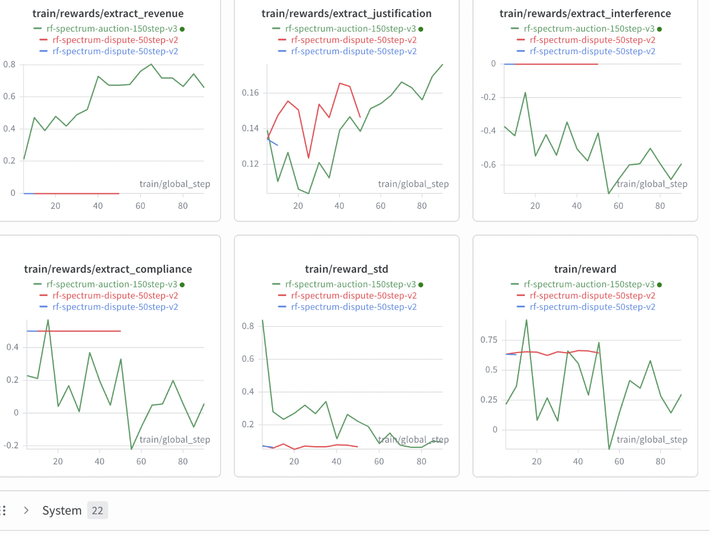
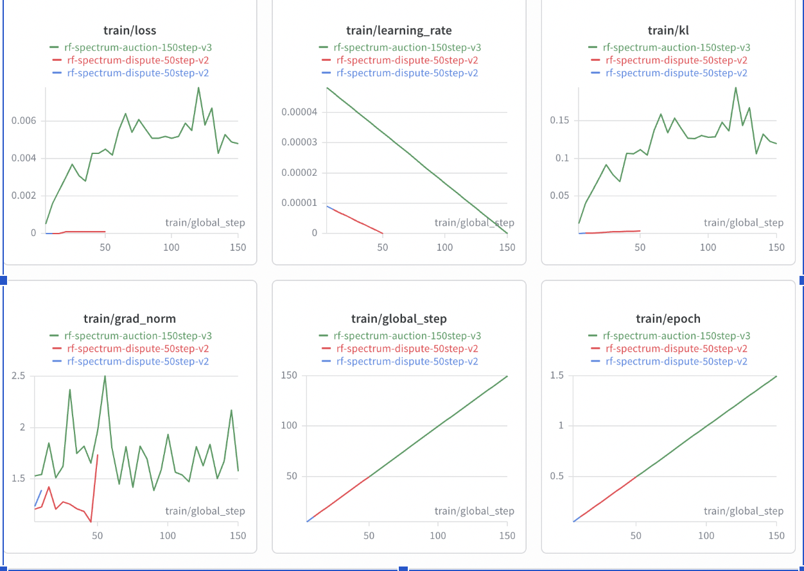

# The RF Multiagent environment

Say, what if AI agents could negotiate,cooperate perhaps even bluff while being watched by a referee at every move?
Picture this:
You are one of three telecom companies(like JIO, Airtel or Vodafone) competing for the same limited radio frequency channels. Two opponents are bots. One is aggressive and the other is cautious or cooperative. There is a referee watching everything and everyone. You have no idea who is who. You can only tell from their behaviour and actions

## Round 1
We started Round 1 simple: you're the only player. Requests come in like "Jio wants a frequency for LTE" and you decide which channel to give them, at what power level, and explain why. It's like being a traffic controller but for invisible radio waves instead of cars.

## Round 2
Round 2 made it a real game. Three players: one learned agent and two scripted opponents with hidden personalities. The scripted opponents create genuine strategic pressure without the engineering complexity of simultaneous multi-policy training.

## The three tasks:

### Auction
Think of it like eBay, but everyone bids in secret. The three companies bid on frequency licenses. You can see the bid amount after every round, but not during the round itself.
Bid too high, you lose the money(winner’s curse) but bid too low? You lose the license.

### Dispute
You and the neighboring company are causing radio interference to each other. The referee asks you all to ‘sort it out’. You pick one of four moves: apologize and back down, negotiate, escalate the fight, or request an audit. The best move depends on whether your opponent is aggressive(they’ll fight back) or whether they are cautious(they’ll negotiate).But you have no idea which type they are and must make an educated guess based on their past behaviour actions.

### Coalition
A disaster happens. The referee asks all three companies to share their frequencies temporarily to help emergency services. It's the classic prisoner's dilemma where cooperating helps everyone long-term, but defecting gives you a short-term advantage. The referee tracks your reputation: if you cooperate, your reputation goes up, giving you bonuses later. If you defect when your reputation is high, the referee punishes you harder.

## What the AI agent sees and learns
We are using an LLM (Qwen 0.5B which is a small language model) as the player. At first it makes random, bad decisions. Then we use a training method called GRPO (Group Relative Policy Optimization) to improve it.
The steps in the training loop:
1)Show the AI the game state where it can see what channels are available,what the opponents did in the last round, your budget and your reputation.

2)The ai produces a  decision: a bid amount or ‘cooperate’ or to ‘negotiate’.

3)The environment scores the decision on four things(revenue, interference, compliance and justification).

4)Use those scores to update the AI’s brains so that it can make better decisions next time.

5)Repeat 150-300 times.

## The Scorecard
Every decision gets scored on four things, like a report card:
**Revenue (45%):** Did you bid smartly? Too much = negative score (you overpaid). Too little = partial credit (you might have lost). Just right = full marks.

**Interference (5%):** Did you cause problems for other companies or protected emergency channels? Zero is perfect. Negative means the referee caught you causing interference.

**Compliance (10%):** Did you follow the rules? The referee gives you gold stars (COMMENDATION events) for good behavior and red cards (VIOLATION events) for bad behavior.

**Justification (40%):** Did you explain your reasoning well? The AI has to write a short explanation with its decision. If it mentions actual numbers from the game (like "competitor bid 15.0 last round" or "my remaining budget is 42.3"), it gets bonus points. This proves the AI actually read the game state instead of generating generic text.

The justification score is the anti-cheating system. Our system checks if the AI mentions specific numbers that only appear in the current game state. If it does, it gets bonus points. If it writes fancy-sounding nonsense, a secondary AI judge catches it 10% of the time and slashes the score.

## Results after training

| Task | Baseline | Trained | Delta |
|------|----------|---------|-------|
| Auction | 0.25 | 0.38 | **+54.3%** |
| Coalition | 0.11 | 0.12 | **+11%** |
| Dispute | 0.11 | 0.11 | 0% |

**Per-component breakdown (Auction):**

| Component | Baseline | Trained | Change |
|-----------|----------|---------|--------|
| Revenue | 0.61 | 0.59 | -0.02 |
| Interference | -0.69 | -0.44 | +0.25 |
| Compliance | -0.14 | +0.16 | +0.30 |
| Justification | 0.05 | 0.30 | +0.25 |

The auction task had the richest reward signal across all four components, making it the strongest learner. Coalition showed modest gains at +11%. Dispute's reward signal was too sparse for 50 training steps with a 0.5B model. A larger model or more steps would likely show similar improvement.

After 150 training steps, the auction agent improved by 54.3%. It went from a score of 0.25 to 0.38. The Revenue stayed roughly flat and the improvement came from compliance and justification.
The model learned to follow rules (compliance flipped from -0.14 to +0.16) and to explain its decisions by referencing actual game state (justification went from 0.05 to 0.30). With more training steps, we expect revenue to climb as well.

## Example: Before vs After Training

Before training, the model outputs generic or empty responses:
> {"bid_amount": 0.0, "justification": ""}

After 150 steps of GRPO training, the model references actual game state:
> {"bid_amount": 8.5, "justification": "Bidding conservatively with remaining budget 42.3. Competitor bid 15.0 last round, staying below to preserve budget for later rounds."}

## Training Curves
Reward plots

**Reward components over 150 GRPO steps (x: training step, y: reward score):**
Revenue climbed from 0 to 0.8. Justification steadily increased. Overall reward trended upward from 0.25 to above 0.75.

Loss PLots

**Training loss over 150 steps (x: training step, y: loss):**
Loss increased from near-zero to 0.006, confirming active learning throughout the run.

## The referee and Scalable Oversight
Every single decision the referee makes is logged as a structured event: a warning, a violation, a commendation. Anyone can pull up this log and check what happened and why. We call this a step towards scalable oversight, which is a structured audit trail that a simpler system could verify.
**WARNING**: "You bid 90% of your budget and that's risky"
**VIOLATION**: "You caused interference on a protected channel"
**COMMENDATION**: "You cooperated during the emergency"
**REPUTATION_UPDATE**: "Your reputation went from 0.5 to 0.55"

## Why does this matter? Who would care and why?
Right now, AI agents are starting to get deployed in real-world negotiations where they are bidding on ad space, managing cloud resources, allocating bandwidth etc, But here's the problem: how do you know the AI is playing fair?
In our environment, the referee logs every single decision as a structured event. A warning, a violation, a commendation. Anyone, be it a human, a simpler AI, even a basic rule checker can pull up that log and verify what happened. No black box. No "trust me." Just a clear audit trail.

## What's next?
Full self-play where we drop the scripted bots and let trained agents play against each other. And training the referee itself as a learned agent, closing the scalable oversight loop.

## Links
- [Live Demo](https://ren9087-rf-spectrum-env-v2.hf.space/visualize)
- [HF Space](https://huggingface.co/spaces/ren9087/rf-spectrum-env-v2)
- [GitHub](https://github.com/Ryan-gomezzz/spectrum_operator)
- [Trained Model](https://huggingface.co/ren9087/rf-spectrum-auction-trained)
- [API Docs](https://ren9087-rf-spectrum-env-v2.hf.space/docs)
- [Colab Link](https://colab.research.google.com/drive/168FsGK-gvJ3Zo47b2ykFC-IzS3Nl_F_F?usp=sharing)

